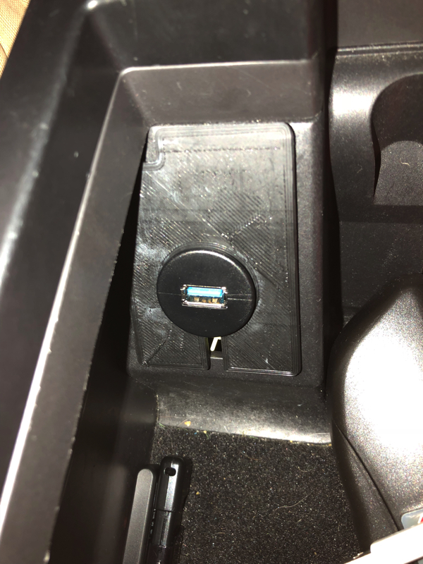
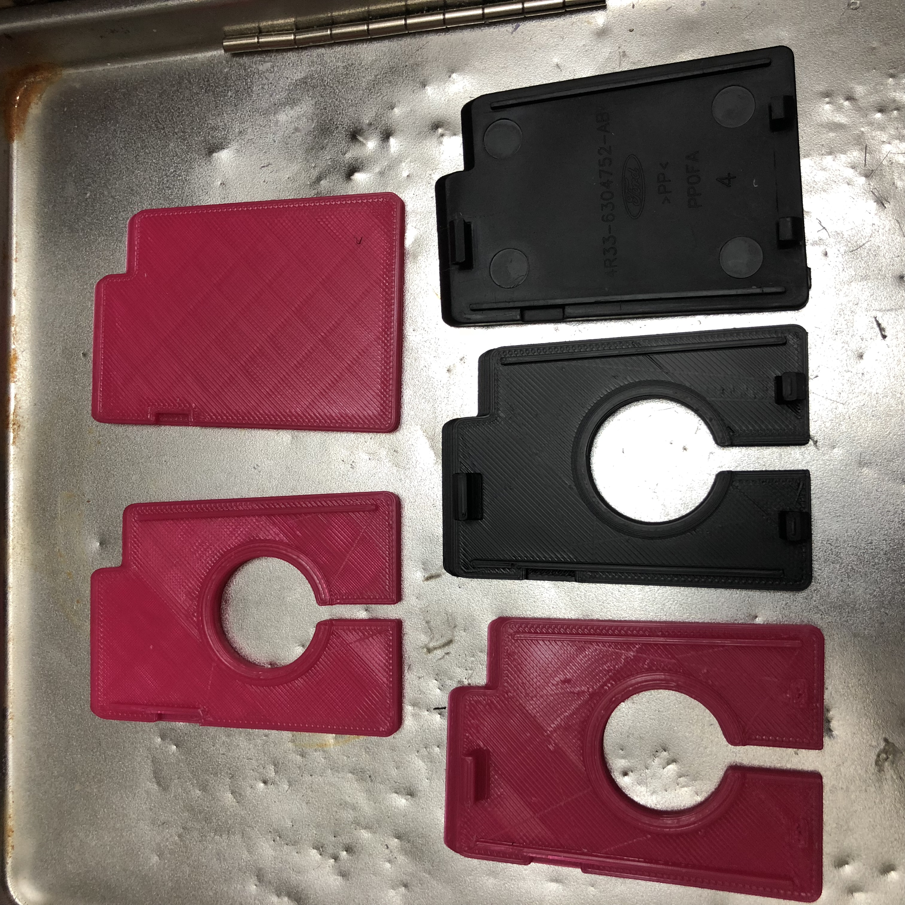
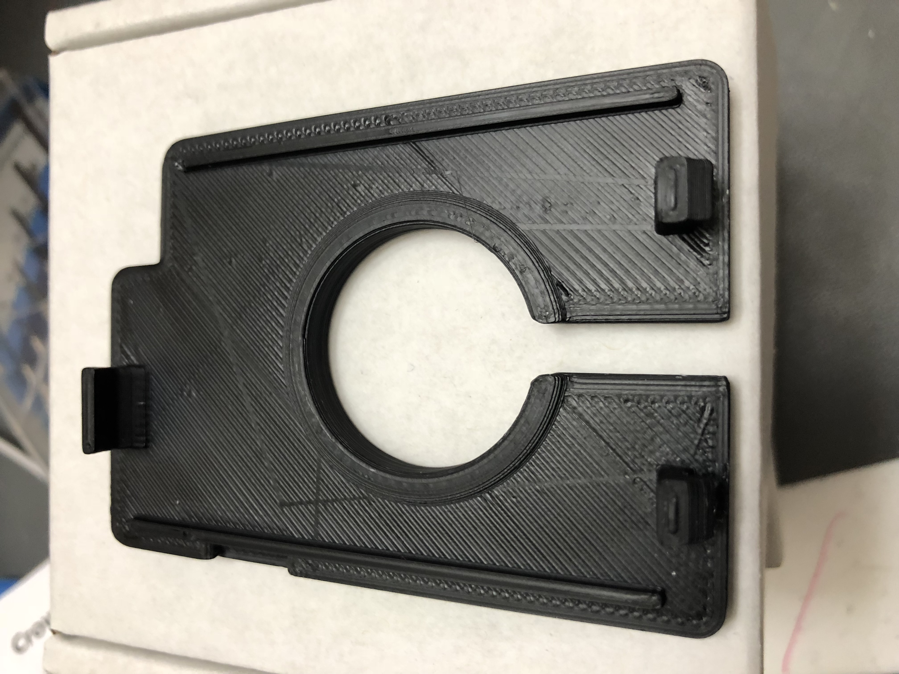
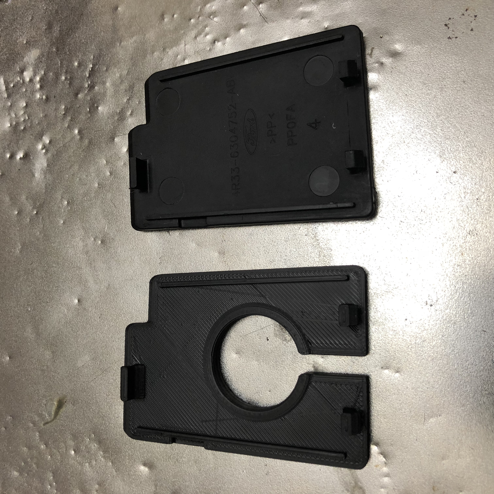
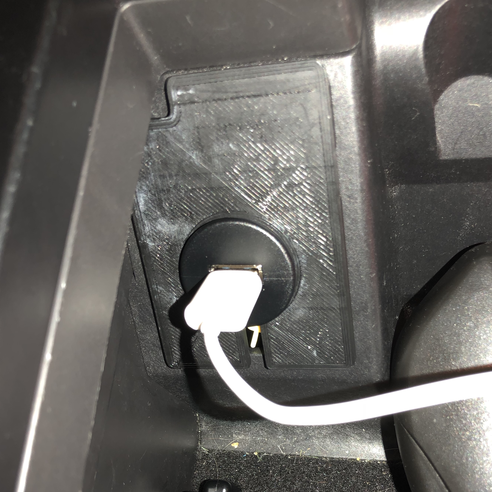

# Panel Cover for USB socket mount in 2005 Ford Mustang

A replacement for factory "blank" cover mount in center console storage compartment in a 2005 Ford Mustang. It was created to hold USB socket for a new car stereo install.




# TODO

 1. Get socket to snap fit. It is currently modeled to similar dimensions as bracket that cable came with. This means the "cigarette lighter" hole is too small for a flush-at-surface mount.

## Reference

- [USB mount cable](https://www.amazon.com/gp/product/B0773GKM2C/) bought on Amazon "LDKCOK USB 3.0 Mount Cable –USB Extension Flush, Dash, Panel Mount Cable, for Car, Boat, Motorcycle and More (6ft/2m)"
- Ford part number that it's substitute for: "Ford Mustang Center Console Secondary Outlet Cover" [4R33-6304752-AB](https://www.google.com/search?q=4R33-6304752-AB&oq=4R33-6304752-AB)

## Files

```
├── USB_plug_panel_cover_for_2005_Mustang_center_console.f3d
└── USB_plug_panel_cover_for_2005_Mustang_center_console.stl
```

## Photos

Design progression








## Methodology

I took measurements of the Ford plastic part being replaced as well as a desktop mount that came with the USB cable kit.

I modeled the replacement part in Autodesk Fusion 360.

  - For iterative prototyping, printed in PLA on Lulzbot Mini (at "fast" setting)
  - For final print, printed in ABS on Lulzbot Mini (no rescaling, at "detailed" setting)



## Thingiverse

[Panel Cover for USB socket mount in 2005 Ford Mustang](https://www.thingiverse.com/thing:3042958) by [dpc](http://www.thingiverse.com/dpc/about)
