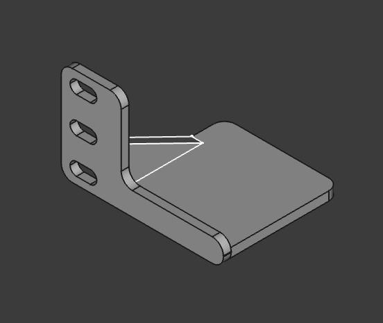

# 10-inch rackmount back-side cantilevered shelf supports

I print some largish 10-inch rackmount shelves in PLA. Adapted these brackets to help with potential cantilever droops for one of the network switches with PSU power brick included on the 10-inch shelf, but should be easy to adapt to others.

### Dimensions

The support "shelf" extends `52 mm` back into rackmount interior from flush with rear rail, and about `52 mm` along face from rack rail's inside edge.

Front rack to back rack rail spacing is `200 mm` according to design drawings.

## Modifications

Started with FreeCAD document `Rack mount holder.fcstd` from [Simple 1U rack mount holder or shelf](https://www.printables.com/model/1298178-simple-1u-rack-mount-holder-or-shelf). Imported into FreeCAD 1.0.1 on macOS.

- extended the "Holder" and the *face plate* `12 mm` in both the X- and Y- directions (into the interior of the rackmount unit)
- lowered the "Holder" component to be flush with bottom.
  - extend brace to meet the "Holder" in its new position.

# Related / Published

- [10-inch rackmount back-side cantilevered shelf supports by idcrook](https://www.printables.com/model/1345555-10-inch-rackmount-back-side-cantilevered-shelf-sup)

- [10-inch rack mount for PoE switch TL-SG108PE V2 with adjacent PSU by idcrook](https://www.printables.com/model/1341088-10-inch-rack-mount-for-poe-switch-tl-sg108pe-v2-wi)
