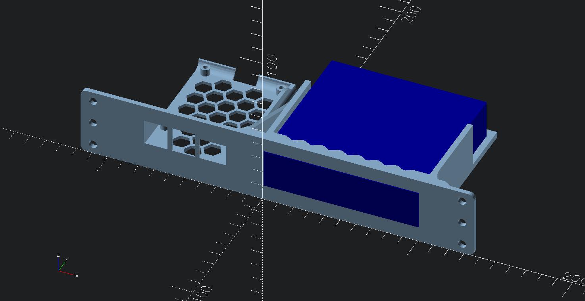

# "Mini Rack" 10-inch Rack mount setup

"Mini Purple Green Monster"

-	[DeskPi RackMate T1 Rackmount](https://www.amazon.com/dp/B0FBFDZD4C)
	-	8U Rack-mount stand includes 1U Blanks, Self 1U rack, SBC shelf, accessories

### Racks / Shelfs / Panels

-	1U - **Included with T1**: "*SBC shelf*"

	-	Raspberry Pi 5 X 2 with docking USB Power + HDMI daughter cards

-	1U - [**3D Print**](https://www.printables.com/make/2710895) Have multiple Raspberry Pis with PoE HAT

	- Printables.com: [Raspberry Pi 1U 10-inch rack-mount bracket fits 3 PoE RasPis](https://www.printables.com/model/1343681-raspberry-pi-1u-10-inch-rack-mount-bracket-fits-3)
        - [Make on printables.com](https://www.printables.com/make/2710895)

	-	My customized:  [3X Pi 4/Pi 5 design](https://github.com/idcrook/psychic-winner/tree/main/10inch_rackmount_1U_raspis) [Github]

		-	sled from [Raspberry Pi 4/5 1U rack-mount bracket by russross - Thingiverse](https://www.thingiverse.com/thing:4125055)

-	1U - [**3D Print**](tp-link_SG105E) For TP-Link Network Switch (TL-SG105E V3)

	-	Printables.com: [10" inch 1U rack mount for side-by-side Raspberry Pi 4 and TL-SG105E Ver. 3](https://www.printables.com/model/1351523-10-inch-1u-rack-mount-for-side-by-side-raspberry-p)
	-	remixed from: [U1 10" Inch Rack Mount for Raspberry Pi 4 and TL-SG105 by AngeloDK](https://www.printables.com/model/1202640-u1-10-inch-rack-mount-for-raspberry-pi-4-and-tl-sg/remixes)

-	1U - [**3D Print**](tp-link_SG108PE) For TP-Link Network Switch (TL-SG108PE V2)

	-	Remixed for my Ver. 2.6: [10-inch rack mount for PoE switch TL-SG108PE V2 with adjacent PSU](https://www.printables.com/model/1341088-10-inch-rack-mount-for-poe-switch-tl-sg108pe-v2-wi)
	-	From: [10" Switch Rack Mount (TL-SG108PE) by ThoreB](https://www.printables.com/model/1166364-10-switch-rack-mount-tl-sg108pe)

-	1U - **3rd Party**: [Enmane 12-Port CAT6 Keystone Patch Panel for Rackmount 1U10inch Panel with Smart Cable Mangement](https://www.amazon.com/dp/B0D5TZFDN1)

-	1U - [**3D Print**](yuanley_YS25-0801) For YuanLey 8 Port 2.5G Ethernet Switch with 10G SFP (YS25-0801)

	-	[10-inch 1U rackmount for YuanLey YS25-0801 8 Port 2.5G + 10G SFP switch rack mount](https://www.printables.com/model/1341992-10-inch-1u-rackmount-for-yuanley-ys25-0801-8-port)
	-	customized from 19-inch rack version: [YuanLey 8 Port 2.5G switch rack mount by Patrik](https://www.printables.com/model/855167-yuanley-8-port-25g-switch-rack-mount)

-	1U - [**3D Print**](yuanley_YS25-0402) For YuanLey 4 Port 2.5G Ethernet Switch with 2X 10G SFP (YS25-0402)

    - Printables.com: [10-inch 1U rack mount shelf for YuanLey YS25-0402 (4 Port 2.5 GbE plus 2 Port 10G SFP+ ethernet switch)](https://www.printables.com/model/1392480-10-inch-1u-rack-mount-shelf-for-yuanley-ys25-0402)
    - Derived from <https://github.com/wildegnux/universal-rack-shelf>
      - Source: [universal-rack-shelf/rack_shelf.json - idcrook/universal-rack-shelf](https://github.com/idcrook/universal-rack-shelf/blob/88303ee16b30d2e1e216f8eee74f86ba26137206/rack_shelf.json#L86C10-L86C20)

-	1U - [**3D Print**](yuanley_YS25-0802) For YuanLey 8 Port 2.5G Ethernet Switch with 2X 10G SFP (YS25-0802)

    - Printables.com: [10-inch 1U rack mount shelf for YuanLey YS25-0802 - 8 Port 2.5 GbE plus 2 Port 10G SFP+ ethernet switch](https://www.printables.com/model/1398000-10-inch-1u-rack-mount-shelf-for-yuanley-ys25-0802)
      - Make: [Make of 10-inch 1U rack mount shelf for YuanLey YS25-0802 - 8 Port 2.5 GbE plus 2 Port 10G SFP+ ethernet switch](https://www.printables.com/make/2818751)
    - Derived from <https://github.com/wildegnux/universal-rack-shelf>
      - Source: [universal-rack-shelf/rack_shelf.json · idcrook/universal-rack-shelf](https://github.com/idcrook/universal-rack-shelf/blob/06957e0e2e27abfa9122f41c9872b261ac03495e/rack_shelf.json#L129)

### Individual Model mockups

<dl>
<dt>10-inch rack mount for PoE switch TL-SG108PE V2 with adjacent PSU</dt>
<dd>

</dd>
<dt>back-side platform brace</dt>
<dd>

</dd>
<dt>10-inch rack mount for managed switch TL-SG105E V3 with side-by-side Pi 4</dt>
<dd>

</dd>
<dt>10-inch rack mount for YuanLey 2.5 GbE YS25-0801 switch</dt>
<dd>

</dd>
<dt>10-inch rack mount for YuanLey 2.5 GbE YS25-0402 switch</dt>
<dd>

</dd>
<dt>10-inch rack mount for YuanLey 2.5 GbE YS25-0802 switch</dt>
<dd>

</dd>

</dl>

## See Also

- [Project MINI RACK | Miniature rack builds, for portable or compact Homelabs.](https://mini-rack.jeffgeerling.com/#3d-printable-systems)

