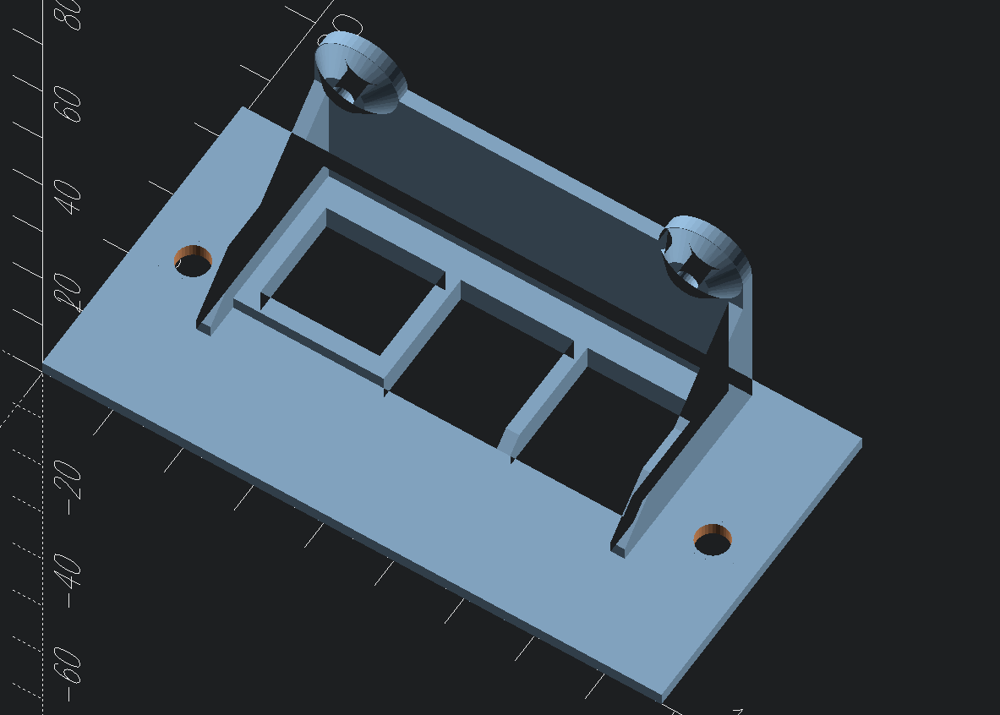
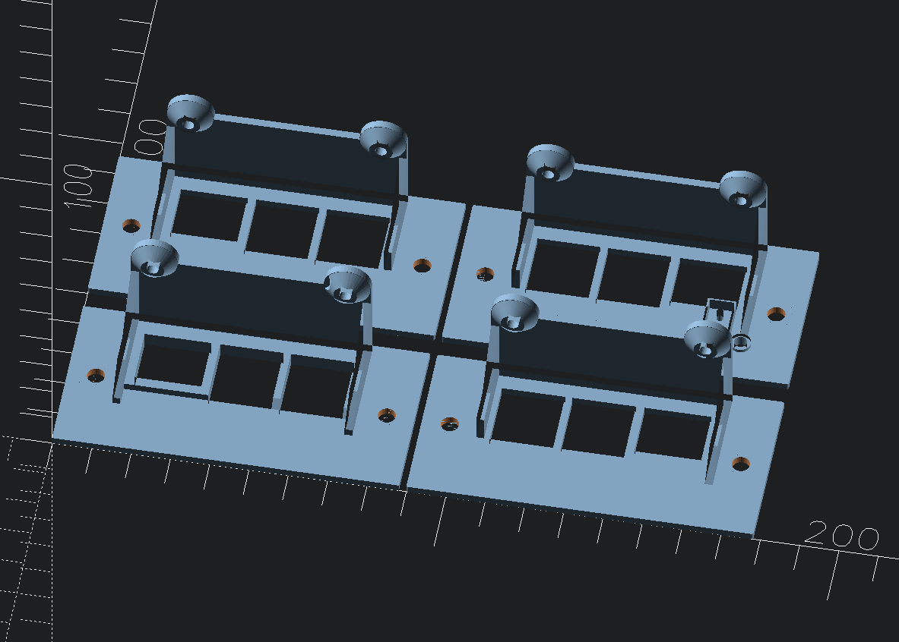
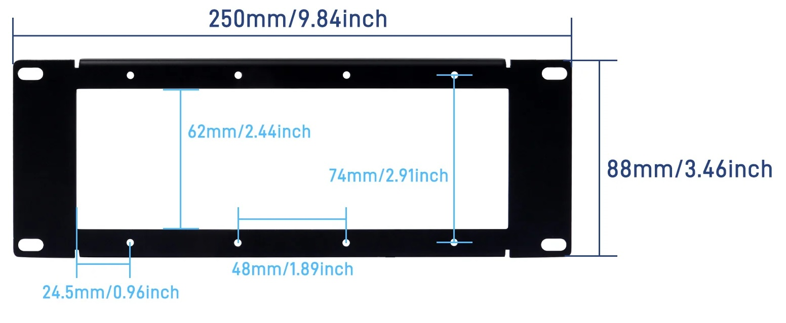

# Raspberry Pi vertical shelves for DeskPi 10-inch DIY 2U Rack Mount

 - Pi5 tray for largish POE + full-size NVMe HAT
 - Pi4 trays with or without switch
 - Plain Pi B+ tray

Adapted from [Raspberry Pi 5 rack mount w/ POE & M2 support](https://makerworld.com/en/models/775329-raspberry-pi-5-rack-mount-w-poe-m2-support) (hole spacing `76 mm`)

Adapted from [RackPi Raspberry Pi (2B / 3B / 3B+ / 4B) Rack Shield 19" 2U with OLED & Power Switch](https://www.thingiverse.com/thing:3022136) (hole spacing `76 mm`)

Adapted to fit the hole spacing in [DeskPi Rackmate Accessories 10 inch 2U Rack Mount For DIY Project, supports Installation of T0/T1/T2](https://deskpi.com/products/deskpi-rackmate-accessories-10-inch-2u-rack-mount-for-diy-project-supports-installation-of-t0-t1-t2) of `74 mm`

### Product dimensions

From Product page

 - vertical hole spacing: `74 mm`

