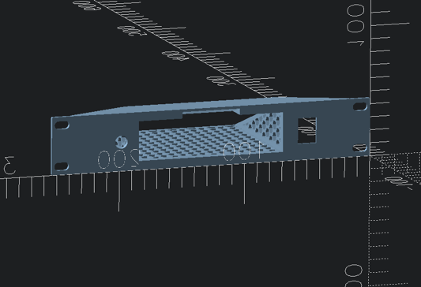
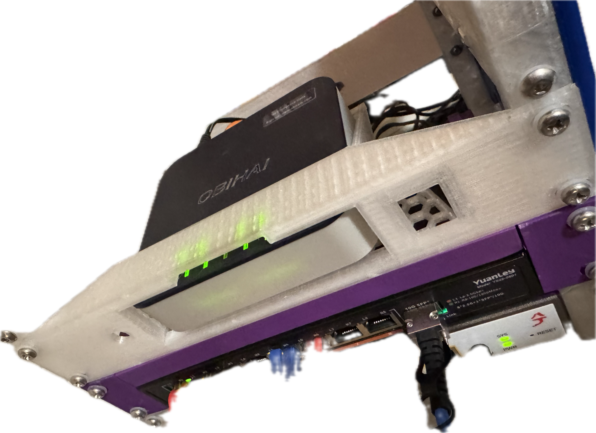

# 10-inch 1U rackmount Obihai Obi202 - VoIP Phone adapter with 2 lines

I wanted to place in my 10-inch rackmount setup, so I used universal rack generator.

Created **obihai_obi202** parameter set in my fork: [universal-rack-shelf/rack_shelf.json](https://github.com/idcrook/universal-rack-shelf/blob/9f94fab58d525716cfaa5c3257eedbf158940fec/rack_shelf.json#L215)

##  Dimensions

Exterior

-   `114 x 105 x 30 mm` (`4.5 X 2.1 x 1.2 inch`)

# Published

- Printables.com: <https://www.printables.com/model/1457294-10-inch-1u-rackmount-obihai-obi202>
