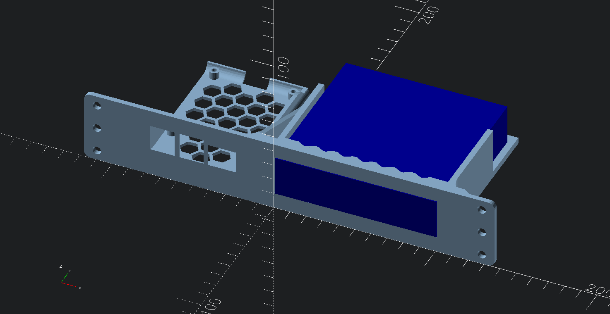

# TP-LINK TL-SG105E (Ver. 3.0)

Wanted to use in my 10-inch rack setup since I need the extra space under the Pi for an errant tall PoE HAT in a 1U rack below where this rack will be installed.

Adapted from [U1 10" Inch Rack Mount for Raspberry Pi 4 and TL-SG105 by AngeloDK | Download free STL model | Printables.com](https://www.printables.com/model/1202640-u1-10-inch-rack-mount-for-raspberry-pi-4-and-tl-sg)

## Differences

 - Repaired the .STL mesh (using PrusaSlicer) so that OpenSCAD could be used to remix
 - Trimmed walls above and around cooling areas in rear of switch enclosure
 - Added half-cross mount screw hole outlines (switch rests on its cutouts)
 - Shrunk bores on M2.5 pi mount posts ever so slightly

## Dimensions

https://www.tp-link.com/us/support/download/tl-sg105e/v3/

Exterior

-	`100 X 98 X 25 mm`
-	distance between mounting holes: `52 mm`
	-	`49.5 mm` from front
	-	`48.5 mm` from rear

# Shared

- Printables: [10" inch 1U rack mount for side-by-side Raspberry Pi 4 and TL-SG105E Ver. 3](https://www.printables.com/model/1351523-10-inch-1u-rack-mount-for-side-by-side-raspberry-p)
