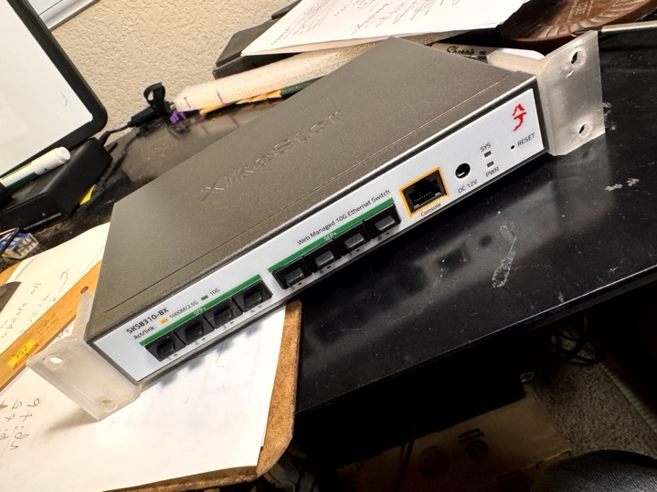
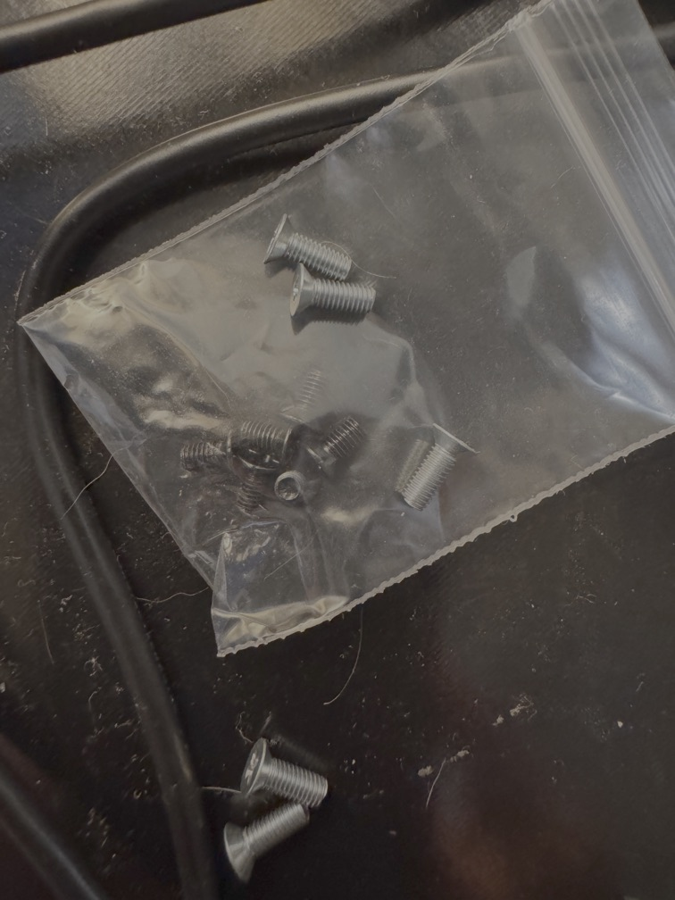

# Xikestor SKS8310-8X - 8-port SFP+ 10G Managed ethernet switch

The *Xikestor SKS8310-8X* switch included metal ears for 19-inch 1U rackmount.  I needed to place in my 10-inch rackmount setup, so I designed these.

## Installed

## Ears for 10-inch rackmount

The mounts on the switch are symmetrical and so are the ears. So print two of the included 10-inch ear model (one for each side). Made countersink holes, so the screw head can be flush with ear bracket.

Also needed:

- `6` count of `M3 8mm` screws
  - The `M3 5mm` screws that came with the switch for the included 19-inch rackmount metal ears aren't long enough for the 3D-printed ears, since the plastic ear is thicker than the metal ear.

## Switch Dimensions

Exterior

-	`207 X 136 x 35 mm` (`207 X 133 x 35 mm`)
-	distance between mounting holes: `147 mm`
	-	measured `67 mm` from front face
	-	measured `66 mm` from rear face

# Published

- [Xikestor SKS8310-8X rackmount 1U Ears for 10-inch rack by idcrook | Download free STL model | Printables.com](https://www.printables.com/model/1434515-xikestor-sks8310-8x-rackmount-1u-ears-for-10-inch)
