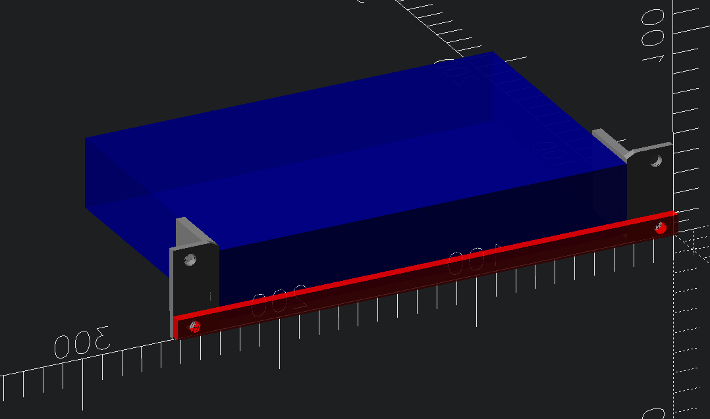

# Xikestor SKS8310-8X - 8-port SFP+ 10G Managed ethernet switch

## Switch Dimensions

[Zyxel GS1100-16 v2 10" Rack Ears by vsz | Download free STL model | Printables.com](https://www.printables.com/model/276404-zyxel-gs1100-16-v2-10-rack-ears)

Exterior

-	`207 X 136 x 35 mm`  (`7.76 X 2.87 X 1.14 inch`)
-	distance between mounting holes: `147 mm`
	-	measured `43.4 mm` from front
	-	measured `29.5 mm` from rear

# Published

- [10-inch 1U rackmount for YuanLey YS25-0801 8 Port 2.5G + 10G SFP switch rack mount by idcrook | Download free STL model | Printables.com](https://www.printables.com/model/1341992-10-inch-1u-rackmount-for-yuanley-ys25-0801-8-port)
