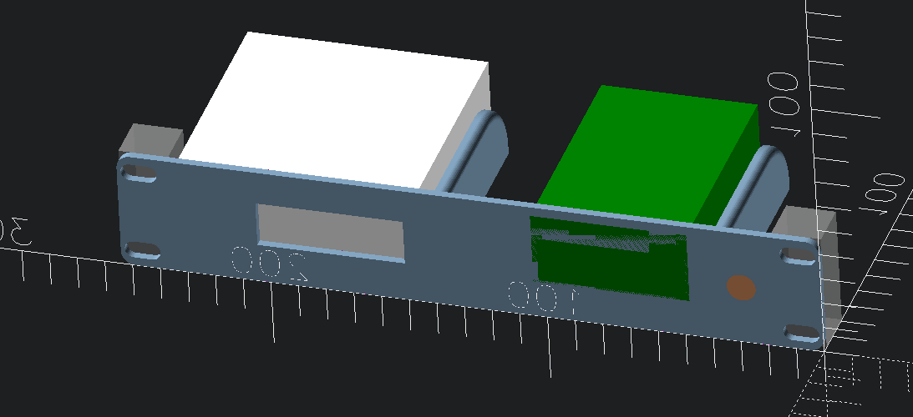
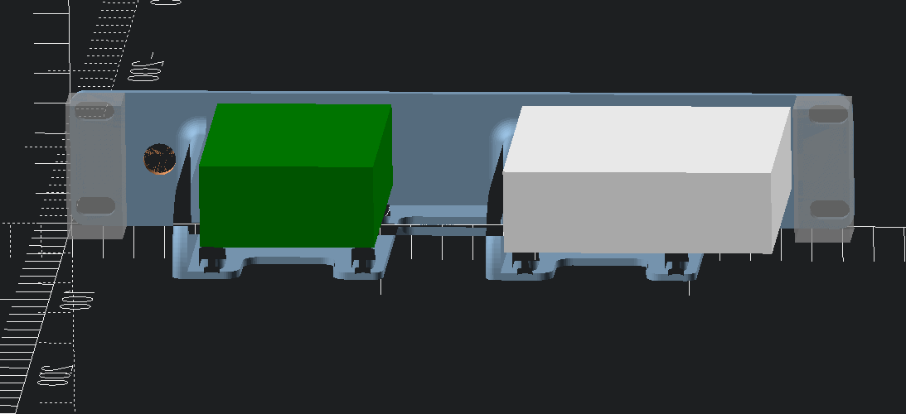
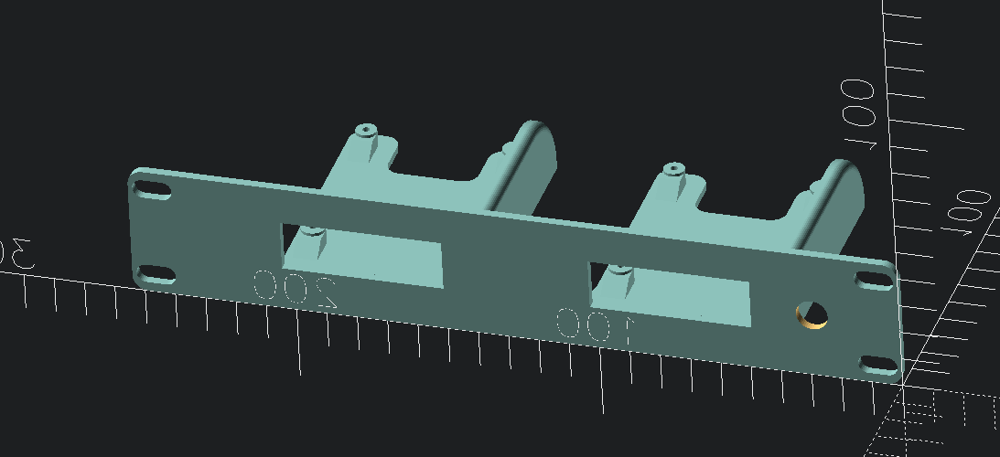

# 10-inch rackmount to accomodate side-by-side yolink smart hub and Raspberry Pi model B with audio cable

Wanted to use in my 10-inch rack setup. Adapted from [Raspberry Pi 2B/3B/4B/5B 10-inch Rack Mount by Maurício Pessoa](https://www.printables.com/model/1185545-raspberry-pi-2b3b4b5b-10-inch-rack-mount/files) and sized out in OpenSCAD to ascertain the two devices would fit and not interfere with rack or otherwise. For now, just placing yolink hub in area where a raspi would go. may create a proper mount in the future.

## Differences

 - added a 10 mm hole in faceplate to pass a stereo audio cable through.
 - added capability to place keystone jacks on face plate (not currently using)

## Dimensions

yolink smart hub - model YS1603

Dimensions
 - `87 x 87 x 27 mm`
 - `3.42 x 3.42 x 1.06 inches`

# Shared

- Printables:
