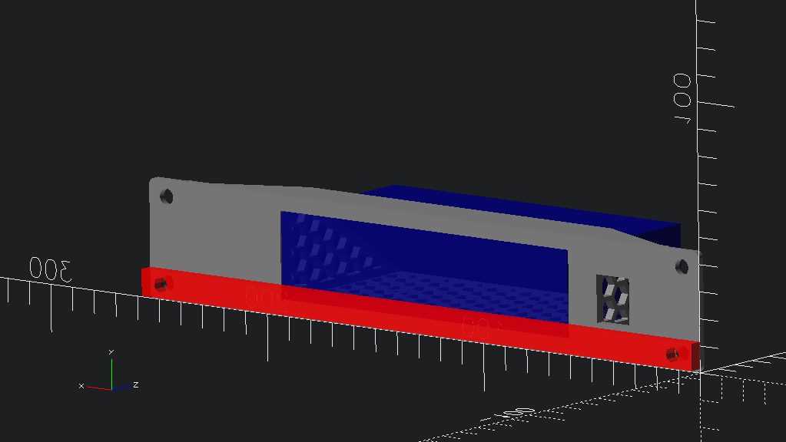

# YuanLey YS25-0402 - 4-port 2.5G unmanaged ethernet switch with 2 X 10G SFP+

`YS25-0402 10-inch rack shelf` [[STL](YS25_0402_10inch_rack.stl)]

Found <https://github.com/wildegnux/universal-rack-shelf> in search for 10-inch rack mount OpenSCAD library, which was linked to from [3D printable 10'' rack shelves #14](https://github.com/geerlingguy/mini-rack/issues/14) in Jeff Geerling's `mini-rack` repo.

Created **YS25-0402** parameter set in my fork [idcrook/universal-rack-shelf rack_shelf.json](https://github.com/idcrook/universal-rack-shelf/blob/88303ee16b30d2e1e216f8eee74f86ba26137206/rack_shelf.json#L86C10-L86C20)

## Switch Dimensions

- https://www.yuanley.com/products/6-port-25g-umanaged-ethernet-switch,-4-x-25g-base-t-ports,-2-x-10g-sfp,-compatible-with-100-1000-2500mbps,-metal-fanless,-desktop-wall-mount-yuanley-25gbe-network-switch-for-wireless-ap,-nas,-pc?VariantsId=10286

Exterior

-   `132 x 66 x 32 mm` (`5.2 X 2.6 x 1.26 inch`)
-	distance between mounting holes: `85 mm` (`3.3 inch`)
	-	measured `37.5 mm` from front
	-	measured `28.5 mm` from rear

Side enclosure screw positions

- center, from base: `4.0 mm`
- center (A), from front: `15.5 mm`
- center (B), from front: `56 mm`
- center (B), from rear: `10 mm`

[Amazon.com: 6 Port 2.5G Unmanaged Ethernet Switch, 4 x 2.5G Base-T Ports, 2 x 10G SFP, Compatible with 100/1000/2500Mbps, VLAN, Fanless, Desktop/Wall Mount YuanLey 2.5Gbe Network Switch for Wireless AP, NAS, PC : Electronics](https://www.amazon.com/Port-Umanaged-SFP-Compatible-YuanLey/dp/B0C64N2QN7?th=1)

# Published
