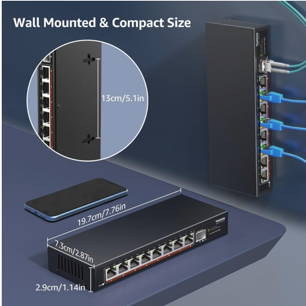

# YuanLey YS25-0801 - 8-port 2.5G unmanaged ethernet with 10G SFP

[Amazon.com: 8 Port 2.5G Unmanaged Desktop Ethernet Switch with 10G SFP, 8 x 2.5G Base-T Ports, 60Gbps Switching Capacity, Compatible with 100/1000/2500Mbps, Metal Fanless, YuanLey 2.5Gbe Network Switch Wall Mount : Electronics](https://www.amazon.com/dp/B0C64X3625)

## Dimensions

Exterior

-	`197.1 X 72.9 X 29.0 mm`  (`7.76 X 2.87 X 1.14 inch`)
-	distance between mounting holes: `130 mm`
	-	measured ` mm` from front
	-	measured ` mm` from rear

# Published
