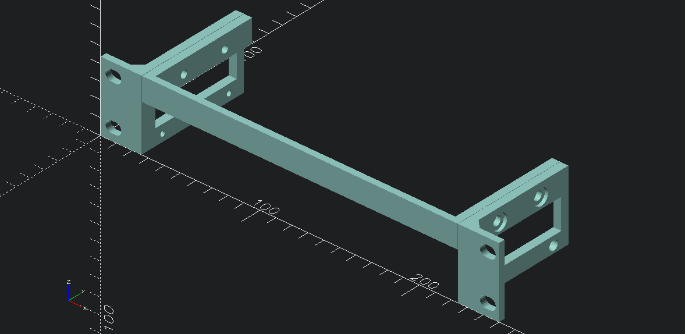

# YuanLey YS25-0801 - 8-port 2.5G unmanaged ethernet with 10G SFP

10-inch rack mount derived from [YuanLey 8 Port 2.5G switch rack mount by Patrik | Download free STL model | Printables.com](https://www.printables.com/model/855167-yuanley-8-port-25g-switch-rack-mount)

## Switch Dimensions

Exterior

-	`197.1 X 72.9 X 29.0 mm`  (`7.76 X 2.87 X 1.14 inch`)
-	distance between mounting holes: `130 mm`
	-	measured `43.4 mm` from front
	-	measured `29.5 mm` from rear

[Amazon.com: 8 Port 2.5G Unmanaged Desktop Ethernet Switch with 10G SFP, 8 x 2.5G Base-T Ports, 60Gbps Switching Capacity, Compatible with 100/1000/2500Mbps, Metal Fanless, YuanLey 2.5Gbe Network Switch Wall Mount : Electronics](https://www.amazon.com/dp/B0C64X3625)

# Published

- [10-inch 1U rackmount for YuanLey YS25-0801 8 Port 2.5G + 10G SFP switch rack mount by idcrook | Download free STL model | Printables.com](https://www.printables.com/model/1341992-10-inch-1u-rackmount-for-yuanley-ys25-0801-8-port)
