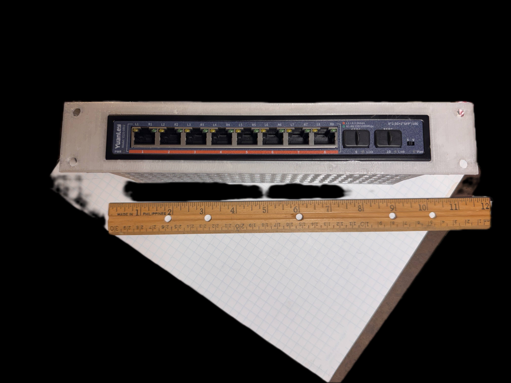
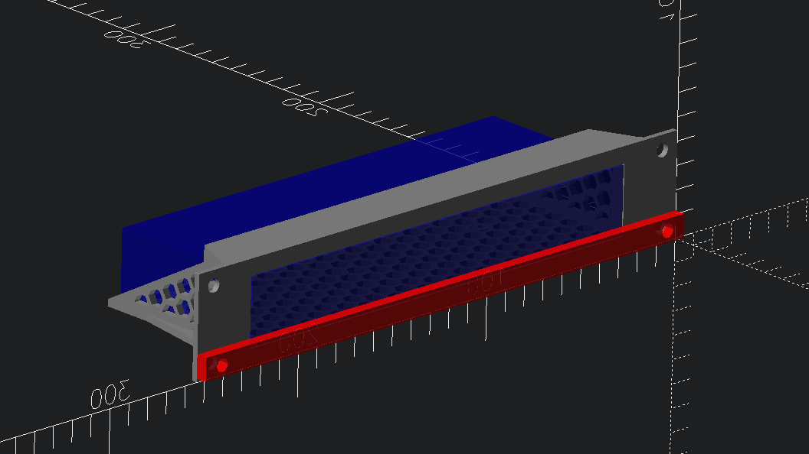
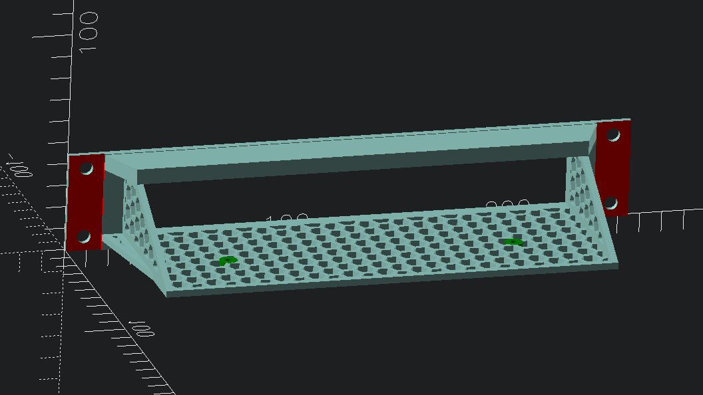
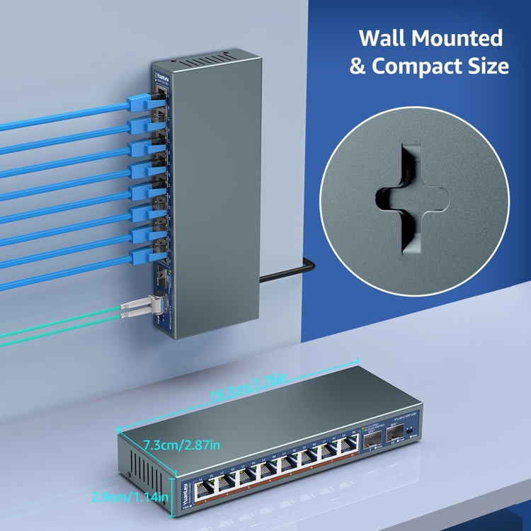

# 10-inch 1U rack mount shelf for YuanLey YS25-0802 - 8 Port 2.5 GbE plus 2 Port 10G SFP+ ethernet switch

`YS25-0802 10-inch rack shelf` [[STL](YS25_0802_10inch_rack.stl)]

Found <https://github.com/wildegnux/universal-rack-shelf> in search for 10-inch rack mount OpenSCAD library, which was linked to from [3D printable 10'' rack shelves #14](https://github.com/geerlingguy/mini-rack/issues/14) in Jeff Geerling's `mini-rack` repo.

Created **YS25-0802** parameter set in my fork: [idcrook/universal-rack-shelf - rack_shelf.json](https://github.com/idcrook/universal-rack-shelf/blob/06957e0e2e27abfa9122f41c9872b261ac03495e/rack_shelf.json#L129)

## Switch Dimensions

Exterior

-   `197.1 x 73 x 29 mm` (`7.76 X 2.87 x 1.14 inch`)
-	distance between mounting holes: `129.5 mm` (`5.1 inch`)
	-	measured `43.5 mm` from front
	-	measured `29.5 mm` from rear

Side enclosure screw positions

- center, from base: `4.0 mm`
- center (A), from front: `15.5 mm`
- center (B), from front: `63 mm`
- center (B), from rear: `10 mm`

[Amazon.com: 10 Port 2.5G Unmanaged Ethernet Switch, 8 x 2.5G Base-T Ports, 2 x 10G SFP, Compatible with 100/1000/2500Mbps, VLAN, Fanless, Desktop/Wall Mount YuanLey 2.5Gbe Network Switch for Wireless AP, NAS, PC : Electronics](https://www.amazon.com/dp/B0F5WF6JPK)

# Published

- Model (Printables): [10-inch 1U rack mount shelf for YuanLey YS25-0802 - 8 Port 2.5 GbE plus 2 Port 10G SFP+ ethernet switch by idcrook | Download free STL model | Printables.com](https://www.printables.com/model/1398000-10-inch-1u-rack-mount-shelf-for-yuanley-ys25-0802)
  - Make (printables): [Make of 10-inch 1U rack mount shelf for YuanLey YS25-0802 - 8 Port 2.5 GbE plus 2 Port 10G SFP+ ethernet switch by idcrook | Download free STL model | Printables.com](https://www.printables.com/make/2818751)
